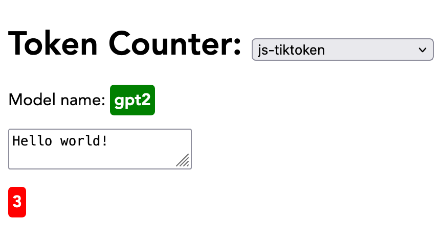
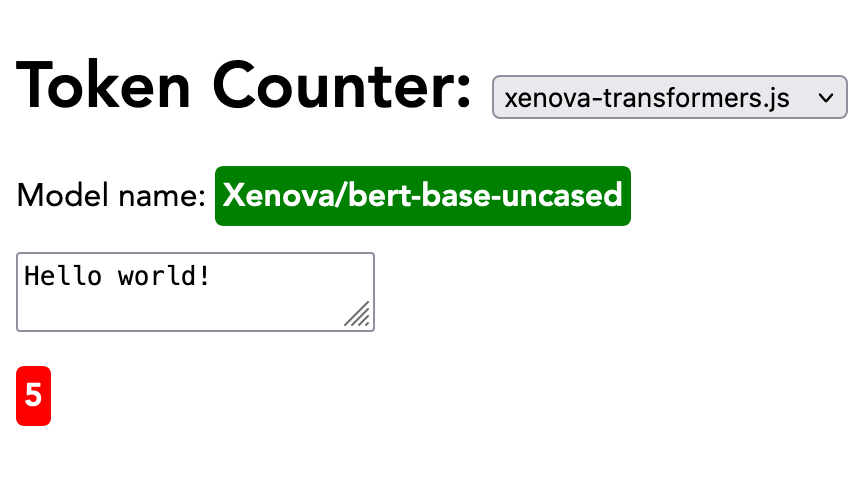
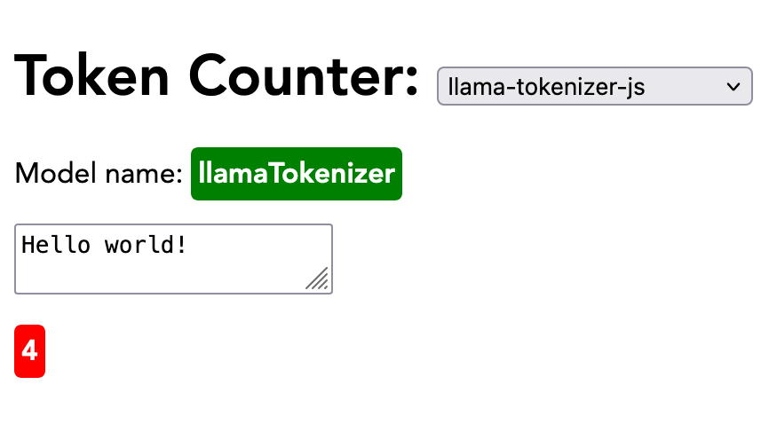

# Learning about LLM token counters

Just one of the things I'm learning. https://github.com/hchiam/learning

Tell the user ahead of time that there’s too many tokens in the input.

## Notes

For example: here’s [OpenAI token counter](https://platform.openai.com/tokenizer) that could be implemented in JS with [`js-tiktoken`](https://www.npmjs.com/package/js-tiktoken):

```js
import { getEncoding, encodingForModel } from "js-tiktoken";
const tokenCount = getEncoding(modelName).encode(text).length;
```

Or maybe for other models, use `@xenova/transformers`:

- https://www.npmjs.com/package/@xenova/transformers
- https://huggingface.co/docs/transformers.js/main/en/api/models#module_models.LlamaPreTrainedModel
- https://huggingface.co/docs/transformers.js/main/en/api/tokenizers#tokenizers

* [LICENSE](https://github.com/xenova/transformers.js/blob/main/LICENSE)

```js
import { AutoTokenizer } from "@xenova/transformers";
const tokenizer = await AutoTokenizer.from_pretrained(modelName);
const { input_ids } = await tokenizer(text);
const tokenCount = input_ids.size; // ?
```

Or maybe use `llama-tokenizer-js` for Meta LLama:

- https://github.com/belladoreai/llama-tokenizer-js?tab=readme-ov-file#-llama-tokenizer-js-
- [LICENSE](https://github.com/belladoreai/llama-tokenizer-js/blob/master/LICENSE.md)

```js
import llamaTokenizer from "llama-tokenizer-js";
const tokenCount = llamaTokenizer.encode(text).length;
```

## Demos

To run repo's demo locally: you need `yarn` and `vite` so you can run `cd demo; yarn dev;` --> http://localhost:5173/

Or just go to this live demo: https://hchiam-llm-token-count.surge.sh/



